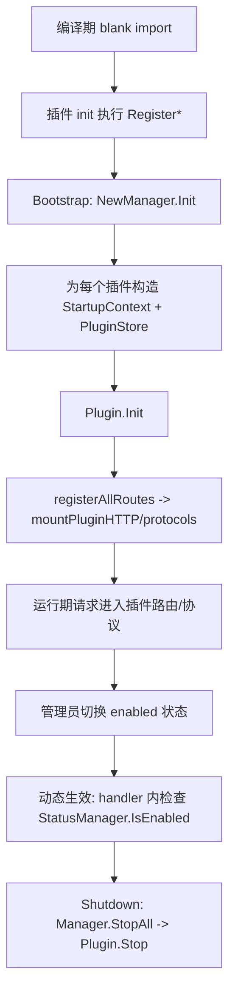
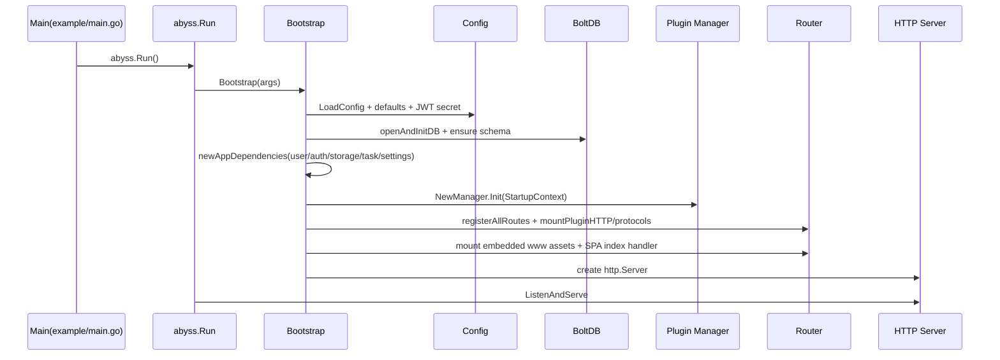
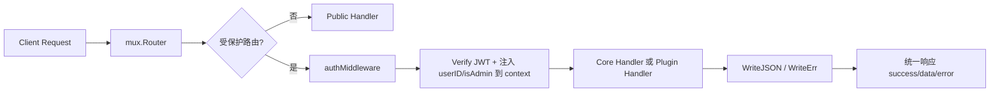

# PROJECT_CONTEXT.md

> 目标：为任意 AI 编码助手提供可直接执行开发任务的「完整项目上下文」。
> 
> 项目：Abyss（高性能、模块化个人云与插件平台）

---

## 1. 项目愿景与技术栈总览 (Project Vision & Stack)

### 1.1 设计理念
Abyss 采用「轻核心 + 可插拔扩展」架构：

- 核心层只保留账号认证、存储编排、任务系统、设置管理、HTTP 基础网关等通用能力。
- 能力扩展通过编译期注册插件实现（`init()` + blank import），运行时通过插件状态开关控制启停行为。
- 前端采用 Vue 3 + TS 单页应用（SPA），由 Go 后端内嵌静态资源并注入运行时配置（`window.Abyss`）。
- 数据层使用 BoltDB（bbolt）嵌入式 KV，零外部服务依赖。

### 1.2 后端技术栈与关键依赖
来自 `go.mod`：

- Go: `go 1.26`
- HTTP Router: `github.com/gorilla/mux v1.8.1`
- JWT: `github.com/golang-jwt/jwt/v5 v5.3.1`
- DB: `go.etcd.io/bbolt v1.4.3`
- 配置解析: `github.com/pelletier/go-toml/v2 v2.3.1`
- 参数校验: `github.com/go-playground/validator/v10 v10.30.2`
- 图像处理: `github.com/disintegration/imaging`
- 测试: `github.com/stretchr/testify`

### 1.3 前端技术栈
来自 `www/package.json`：

- Vue: `^3.5.34`
- Vue Router: `^4.6.4`
- Pinia: `^3.0.4`
- TypeScript: `^5.9.3`
- Vite: `^7.3.3`
- i18n: `vue-i18n`
- SSE 消费（任务）在前端任务域 store 中使用 `EventSource` 语义（后端提供 `text/event-stream`）

### 1.4 通信与安全

- REST API 主通道：`/api/*`
- 实时通道：SSE `GET /api/tasks/events`
- 认证：JWT Access Token + Refresh Token
- Token 传递优先级（后端中间件）：
  1. `X-Auth`
  2. `Authorization: Bearer <token>`
  3. URL Query `auth`（仅 `allowQueryToken=true`）
  4. Cookie `auth`

---

## 2. 代码库目录地图 (Codebase Directory Map)

## 2.1 高层结构

```text
abyss/
├── app.go                  # 应用 Bootstrap / 依赖装配 / 生命周期 + 配置加载与全局设置 + 统一错误模型
├── boltdb.go               # BoltDB 封装 + 所有核心存储实现 + PluginStore
├── identity.go             # 用户模型/权限模型/用户服务 + JWT 签发校验、refresh session + crypto 工具
├── api.go                  # 核心 REST 路由注册与 handler（身份/文件/任务/设置）
├── storage.go              # StorageEngine 抽象 + path 引擎 + metadata 修复 + MIME 探测/图片处理
├── plugin.go               # 插件机制核心：接口、泛型注册栈、状态管理、拓扑排序
├── extensions.go           # 插件可选扩展点：配置/认证/存储/钩子/GC/通知/协议/UI
├── sdk.go                  # 插件 SDK 支撑：Skeleton 基类、事件总线、路由挂接、任务桥接
├── task.go                 # 异步任务引擎、订阅广播（SSE 上游）
├── abyss_test.go           # 全部测试（单文件）
├── docs/                   # 项目文档
├── plugins/                # 社区/基础插件（totp/trash/webdav）
├── pro/                    # Pro 插件（album/passkey/sync/...）
├── example/                # 组合打包入口（基础版/Pro 版）
└── www/                    # Vue3+TS 前端，构建后由 go:embed 嵌入
```

### 2.2 Core / Plugin / Frontend 边界

- Core 物理边界：根目录的 `*.go`（除 `plugins/`, `pro/`）是平台核心。
- Plugin 物理边界：`plugins/*` 与 `pro/*`，每个插件是独立 Go module（通常带独立前端 `www/`）。
- Frontend 物理边界：`www/` 是主站前端；插件可通过 `UIProvider.UIAssets()` 提供附加静态资源。

逻辑边界：

- Core 负责定义接口、生命周期、权限、安全、持久化协议。
- Plugin 只通过 `plugin.go` 暴露的接口与 `StartupContext` 能力访问核心。
- 前端主应用负责路由框架与插件壳层；插件前端通过动态脚本注入注册 UI 扩展。

---

## 3. 数据库与存储架构 (Database & Storage Engine)

## 3.1 BoltDB 总体

核心 DB 初始化在 `openAndInitDB`（`app.go`），调用 `boltEnsureSchema` 建立顶层桶。

### 3.1.1 顶层 Buckets 列表

- `identity_users`
- `identity_users_by_email`
- `identity_users_by_username`
- `identity_sessions`
- `identity_sessions_by_hash`
- `identity_sessions_by_user`
- `storage_files`
- `storage_files_by_user`
- `storage_files_by_user_parent`
- `tasking_tasks`
- `tasking_tasks_by_user`
- `settings`
- 以及动态插件桶：`plugin_<slug>`（懒创建）

### 3.1.2 序列化格式与 Key 约定

- 绝大多数 Value 通过 `json.Marshal/json.Unmarshal` 序列化（见 `boltMarshal/boltUnmarshal`）。
- `uint64` 主键统一使用大端 8 字节（`boltUint64Key`）。
- 索引桶 value 常存放主键（8 字节 PK）或 task/session 主键字符串。

## 3.2 核心实体与索引映射

### 3.2.1 用户

- 主桶：`identity_users`
  - Key: `uint64(id)`
  - Value: `User` JSON
- 邮箱索引：`identity_users_by_email`
  - Key: lowercased email
  - Value: user PK (8 bytes)
- 用户名索引：`identity_users_by_username`
  - Key: lowercased username
  - Value: user PK

### 3.2.2 会话/刷新令牌

- 主桶：`identity_sessions`
  - Key: session ID (`RefreshToken.ID`)
  - Value: `RefreshToken` JSON
- hash 索引：`identity_sessions_by_hash`
  - Key: `sha256(refresh_raw)` hex
  - Value: session ID
- 用户索引：`identity_sessions_by_user`
  - Key: `uint64(userID) + "_" + sessionID`
  - Value: session ID

### 3.2.3 文件元数据

- 主桶：`storage_files`
  - Key: file PK (uint64)
  - Value: `File` JSON
- 用户+路径索引：`storage_files_by_user`
  - Key: `uint64(userID) + 0x00 + normalized_path`
  - Value: file PK
- 用户+父目录索引：`storage_files_by_user_parent`
  - Key: `uint64(userID) + 0x00 + parent + 0x00 + fileID`
  - Value: file PK

### 3.2.4 任务

- 主桶：`tasking_tasks`
  - Key: task ID (UUID string)
  - Value: `TaskInfo` JSON
- 用户索引：`tasking_tasks_by_user`
  - Key: `uint64(userID) + 0x00 + taskID`
  - Value: taskID

### 3.2.5 全局设置

- 桶：`settings`
- Key 固定：`global`
- Value：`Settings` JSON

### 3.2.6 插件存储 `plugin_<slug>`

每个插件一个根桶，内部子结构约定：

- `__schema` 子桶：
  - key `version` -> 当前 schema 版本（兼容历史 uint32 或字符串）
- `__config` key：插件配置原始 bytes
- `kv` 子桶：`PluginStore.Put/Get/Delete` 默认键值区
- 插件可通过迁移 tx 自建更多子桶

## 3.3 文件存储管理 (`storage.go`)

### 3.3.1 物理路径映射

默认 `path` 存储引擎映射规则：

- 用户根目录：`<data.dir>/files/<user.UUID>/`
- 逻辑路径：归一化为 `normalizePath`（总是以 `/` 开头）
- 引擎落盘：`pathEngine.abs(p)` 通过 `filepath.Clean` + `Join(baseDir, clean)`

### 3.3.2 虚拟路径机制

`StorageProvider` 可扩展虚拟路径（例如远端存储、对象存储）：

- `ResolveVirtualPath(ctx, userID, filePath)` 返回 `VirtualPathInfo`
- `GetVirtualEntries(ctx, userID)` 注入虚拟目录项
- `CreateUserEngine(userID)` 可替代默认 path engine

当前核心依然以元数据表 `storage_files` 作为文件索引权威来源。

### 3.3.3 配额（Quota）现状

- 核心代码目前未实现“硬配额”字段与写入前限额校验。
- 前端有 used-percentage UI 开关（branding），但非后端强约束。
- 当前“容量管理”主要依赖：
  - 文件 metadata `Size` 记录
  - GC / 修复任务
  - 插件自行扩展（若其引擎支持配额）

### 3.3.4 一致性修复

`storageService.RepairConsistency`：

1. 扫描 DB 元数据，清除孤儿 metadata（文件不存在）
2. 扫描文件系统，补齐缺失 metadata（文件存在但 DB 缺）
3. 统计报告：`ScannedMeta/ScannedFS/OrphanMeta/OrphanFile/FixedCount/...`

---

## 4. 插件系统架构与生命周期 (Plugin Architecture & Lifecycle)

## 4.1 核心接口定义（摘录）

```go
// plugin.go

type Plugin interface {
	Base
	Init(ctx *StartupContext) error
	Stop(ctx context.Context) error
	ConfigFields() []ConfigField
	ConfigReceiver(config []byte) error
}

type StartupContext struct {
	Files      Files
	Users      Users
	Logger     *slog.Logger
	BaseURL    string
	Handler    HandlerWrapper
	PluginSlug string
	StoreFactory func(slug string) PluginStore
}

type Router interface {
	Base
	RegisterRoutes(api, global, users RouterGroup, auth func(http.Handler) http.Handler)
}

type UIProvider interface {
	Base
	UIPages() []UIPage
	UIAssets() fs.FS
}

type Protocol interface {
	Base
	ProtocolName() string
	ProtocolPrefix() string
	Handler() http.Handler
}
```

插件注册方式（编译期）：

```go
func init() {
	p := &Plugin{}
	abyss.Register(p)
	abyss.RegisterUIProvider(p)
	abyss.RegisterRouter(p)
	abyss.RegisterProtocol(p)
}
```

## 4.2 插件生命周期



要点：

- 注册与初始化分离：`Register*` 在包 init；`Init` 在 `Bootstrap`。
- 路由全量挂载（`CallRouterAll`），但执行时按 enabled 动态控制。
- 插件状态持久化：`Settings.PluginStatuses` + `StatusManager` persistence hook。

## 4.3 插件路由与 UI 挂载机制

### 4.3.1 HTTP 路由桥

`mountPluginHTTP` 自动提供：

- 插件 API 子路由前缀：`/api/<slug>/*`
- 插件 UI 页面元数据：`GET /api/plugins/ui`
- 插件 i18n 聚合：`GET /api/plugins/i18n`
- 插件列表：`GET /api/plugins/list`
- 管理员开关：`POST /api/settings/plugins/{slug}/enable`
- 配置读写：`GET/PUT /api/settings/plugins/{slug}/config`
- 插件认证方法聚合：`GET /api/auth/methods`

### 4.3.2 插件静态资源

`mountPluginUIAssets` 将插件 `UIAssets()` 暴露为：

- `/static/plugins/<slug>/index.js`
- `/static/plugins/<slug>/abyss-frontend.css`

前端动态加载器：`www/src/plugin/loader.ts`。

## 4.4 实战参考：`plugins/webdav`

### 4.4.1 后端能力

- 同时实现 `Plugin + Router + UIProvider + Protocol`
- Protocol：`/dav`，`ProtocolAuthMode() == none`（插件内部 token 校验）
- 通过插件 store 迁移创建桶：`webdavByID/webdavByToken/webdavByUser`

### 4.4.2 路由注册

```go
func (p *Plugin) RegisterRoutes(api, global, users abyss.RouterGroup, auth func(http.Handler) http.Handler) {
	api.Use(auth)
	p.SetupWebDAVRoutes(api)
}

func (p *Plugin) SetupWebDAVRoutes(group abyss.RouterGroup) {
	tokens := group.Group("/tokens")
	tokens.Handle("", p.ctx.Handler(p.WebdavTokenListHandler)).Methods("GET")
	// ...
}
```

### 4.4.3 新插件最小模板

1. `init()` 中调用对应 `Register*`
2. 实现 `Info()` 返回唯一 `SlugName`
3. 在 `Init(ctx)` 拿到 `ctx.Store()` 并执行迁移
4. 若提供 HTTP，实作 `RegisterRoutes`
5. 若提供前端，实作 `UIAssets()` + `UIPages()`
6. 可选：实现 `Authenticator/StorageProvider/Protocol/...`

---

## 5. 核心运行逻辑与数据流 (Core Logic & Data Flows)

## 5.1 启动引导流



执行顺序（关键）：

1. 配置加载与 flag 覆盖（`app.go`）
2. 创建数据目录
3. 打开 BoltDB 并建 schema
4. 装配服务：user/auth/storage/task/settings
5. 恢复插件启用状态（`Settings.PluginStatuses`）
6. 插件初始化（为每个插件生成隔离 `PluginStore`）
7. 注册核心 + 插件路由
8. 挂载静态资源与 SPA index
9. 启动 HTTP Server

## 5.2 HTTP 请求生命周期



认证中间件行为：

- 解析 token
- `authSvc.VerifyJWT`
- 将 `uid/admin` 注入 context
- handler 中通过 `AuthUserIDFromContext / AuthIsAdminFromContext` 获取

## 5.3 SSE 实时通信机制

实现位置：`App.handleTaskEvents` + `taskService.Subscribe/broadcast`

流：

1. 客户端连接 `GET /api/tasks/events`（需登录）
2. 服务端设置 `Content-Type: text/event-stream`
3. 订阅当前 userID 专属通道
4. 任务状态变更时 `taskService.broadcast` 推送 `TaskInfo`
5. 断连时 `r.Context().Done()` 自动退订

示例事件 payload（`data: <json>`）：

```json
{
  "id": "task-uuid",
  "name": "storage_consistency_repair",
  "userId": 1,
  "status": "running",
  "progress": 0,
  "message": "",
  "createdAt": "...",
  "updatedAt": "..."
}
```

---

## 6. 前后端集成与静态资源分发 (Frontend-Backend Integration)

## 6.1 go:embed 资源嵌入

`www/assets.go`：

```go
//go:embed all:dist
var assets embed.FS

var PublicFS fs.FS
func init() {
	if sub, err := fs.Sub(assets, "dist"); err == nil {
		PublicFS = sub
	}
}
```

后端在 `Bootstrap` 中挂载：

- `/assets/*`, `/img/*`, `/manifest.json`, `/favicon.ico`
- 其余路径回退 `handleIndex`（SPA）

## 6.2 Index Hydration（配置水合）

`handleIndex` 会：

1. 读取 `index.html` 模板
2. 根据 `BaseURL` 重写绝对静态资源路径
3. 注入 `window.Abyss = {...}`（品牌、登录开关、Demo、Tus、BaseURL 等）
4. 前端 `constants.ts` 直接读取 `window.Abyss` 作为运行时配置源

## 6.3 插件前端水合

主前端流程：

- `pluginStore.fetchPluginI18n()` -> `/api/plugins/i18n`
- `pluginStore.fetchPluginPages()` -> `/api/plugins/ui`
- `pluginStore.fetchPlugins()` -> `/api/plugins/list`
- 对 `enabled && hasUI` 的插件调用 `loadPlugin(slug)`，动态注入 JS/CSS
- 插件脚本调用 `window.__ABYSS__.registerPlugin(manifest)` 完成页面/组件/事件注册

## 6.4 API 通信规范

后端统一返回（`WriteJSON`）：

```json
{
  "success": true,
  "data": { }
}
```

错误时：

```json
{
  "success": false,
  "error": "message"
}
```

前端统一 fetch 封装：`www/src/shared/api/utils.ts`

- 默认自动附带 `X-Auth: <jwt>`
- 非 2xx 抛 `StatusError`
- 401 可触发统一未授权处理器

常见错误码映射（`app.go` + `WriteErr`）：

- `not_found` -> 404
- `unauthorized` -> 401
- `forbidden` -> 403
- `conflict` -> 409
- `invalid_input` -> 400
- 其他 -> 500

---

## 7. 开发规范与 AI 贡献指南 (AI Development & Contribution Rules)

## 7.1 必须保持向前兼容的核心结构

修改以下文件需特别谨慎（高兼容性风险）：

- `plugin.go`：插件接口、注册器、路由桥、状态管理
- `storage.go`：`StorageEngine` 接口与路径语义
- `boltdb.go`：bucket 名称、索引 key 编码规则、序列化结构
- `identity.go`：JWT claims 字段（`uid/role/admin/user/...`）
- `api.go`：API 路径与统一响应契约
- `app.go`（Settings）、`identity.go`（User）、`task.go`（Task）：前后端共享数据模型

兼容性铁律：

- 不要重命名现有 bucket。
- 不要改变已持久化结构字段语义（除非提供迁移）。
- 不要破坏统一响应包裹格式 `success/data/error`。
- 不要更改插件 slug 命名与路由前缀约定。

## 7.2 错误处理规范

- 业务错误优先使用 `*Error`（`app.go`）。
- 需要保留原始错误时用 `WrapError(base, cause, msg)`。
- HTTP handler 统一通过 `WriteErr` 或 `WriteJSON` 输出，不直接散落 `http.Error`（SSE/流式等特殊场景除外）。
- 插件 handler 推荐返回 `abyss.Fail(status, err)`，避免自定义格式漂移。

## 7.3 常用开发命令（根 Makefile）

```bash
# 初始化
make setup

# 构建（含 UI）
make build

# 构建基础版 example
make example

# 构建 Pro example
make example-pro

# 全量测试
go test -v ./...
# 或
make test

# 覆盖率
make coverage

# 漏洞扫描
make scan

# Lint
make lint

# 格式化
make fmt
```

前端子项目常用：

```bash
cd www
pnpm install
pnpm dev
pnpm build
```

## 7.4 AI 编码安全提示（高频踩坑）

1. BoltDB 事务安全：
   - 统一通过 `boltView/boltUpdate` 包装事务。
   - 批量更新索引时保持主记录与索引原子一致。

2. 索引同步：
   - 修改用户 email/username、文件 path、task user 归属时，必须同步更新索引桶。

3. 路径安全：
   - 一律使用 `normalizePath`，禁止直接拼接未经清洗路径。
   - 文件系统写入使用临时文件 + rename（当前 pathEngine 已实现）。

4. 认证边界：
   - 所有受保护路由必须挂 auth middleware。
   - 插件协议若 `ProtocolAuthNone`，需在插件内部自行保证鉴权安全。

5. 插件状态动态化：
   - 新插件执行路径应在运行时检查 `StatusManager.IsEnabled` 语义（协议层尤其重要）。

6. 配置兼容：
   - `ConfigReceiver` 需容忍旧字段/缺省值。
   - 插件配置变更优先通过迁移与默认值兼容。

7. 前端 API 兼容：
   - 前端 `fetchJSON` 默认期待 `{success,data,error}`，新接口保持一致。
   - 若返回 204，前端封装会转为 `null`，调用方需兼容。

8. SSE 连接管理：
   - 广播通道必须按 userID 过滤，避免跨用户事件泄露。
   - 断连后必须 `Unsubscribe`。

## 7.5 已识别的上下游契约偏差（开发时需关注）

- 前端存在 `GET /api/setup/status` 调用路径，但当前后端主路由未注册该端点。
- 处理相关任务时需先确认：
  - 是前端历史兼容残留，还是后端漏实现。
  - 若补实现，建议返回 `{initialized: bool}`，并纳入统一响应包裹。

---

## 附录 A：关键代码片段索引

### A.1 统一响应封装

```go
func WriteJSON(w http.ResponseWriter, status int, v any) {
	payload := map[string]any{"success": status < 400}
	if status < 400 {
		payload["data"] = v
	} else {
		payload["error"] = ...
	}
	_ = json.NewEncoder(w).Encode(payload)
}
```

### A.2 Auth 中间件 token 来源

```go
tokenStr := r.Header.Get("X-Auth")
if tokenStr == "" { /* Authorization Bearer */ }
if tokenStr == "" && allowQueryToken { /* ?auth= */ }
if tokenStr == "" { /* cookie auth */ }
```

### A.3 Plugin Manager 初始化

```go
func (m *Manager) Init(ctx *StartupContext) error {
	return CallPluginAll(func(p Plugin) error {
		slug := p.Info().SlugName
		pluginCtx := *ctx
		pluginCtx.PluginSlug = slug
		return p.Init(&pluginCtx)
	})
}
```

---

## 附录 B：AI 任务建议工作流

1. 先确认需求属于 Core、Plugin 还是 Frontend。
2. 涉及持久化先看 `boltdb.go` 的桶与索引。
3. 涉及认证先看 `identity.go` 和 `api.go` 路由保护。
4. 涉及插件先看 `plugin.go` 接口 + 参考 `plugins/webdav`。
5. 改动后至少执行：
   - `go test ./...`
   - 关键路径手测：登录、文件列表、插件页加载、SSE 任务推送。

---

本文件用于 AI 开发上下文引导。若核心接口、路由或数据结构发生变更，请同步更新本文件。